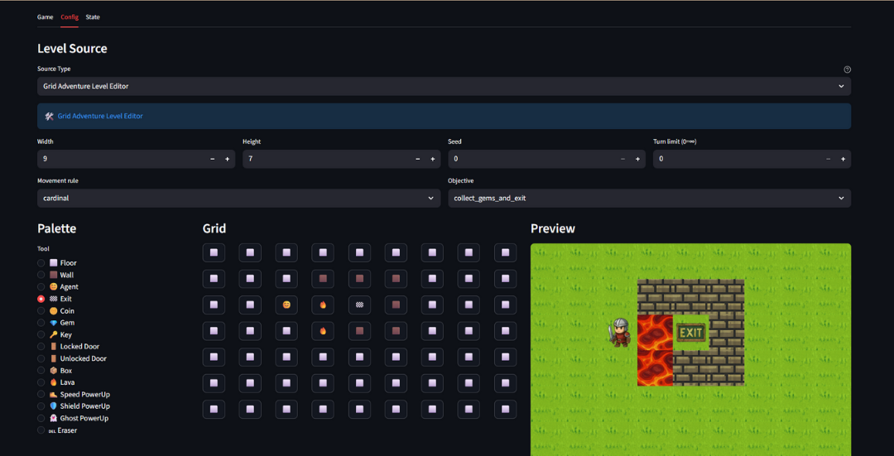
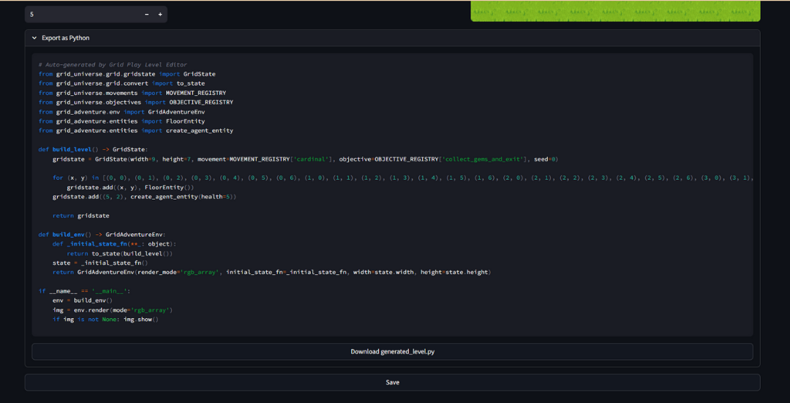

# Config Tab

The Config tab lets you select and configure game levels before playing.

## Level Sources

Grid Play provides two types of level sources:

- Intro Level Selector
- Level Editor

### Intro Level Selector

Pre-designed levels for learning game mechanics.

| Source | Description |
|--------|-------------|
| **Gameplay Example** | 14 tutorial levels with progressive difficulty |

These levels introduce core concepts step-by-step: movement, items, doors, and hazards. Select a level from the dropdown and click **Save** to play.

### Level Editor

Configurable levels for experimentation and testing.

| Features | Usage |
|--------|-------------|
| **Level Config** | Use Width, Height, Seed, Time Limit, Movement Rule, Objective and Agent Health Selector to choose the configuration of the level |
| **Entity Pallette, Grid and Preview** | Use the Entitity Pallete and grid to design the level |

| Features | Usage |
|--------|-------------|
| **Level Exporter** | The Level exporter generates a function to build the designed level |

Once done, just click save to proceed to Game Page to test out level.