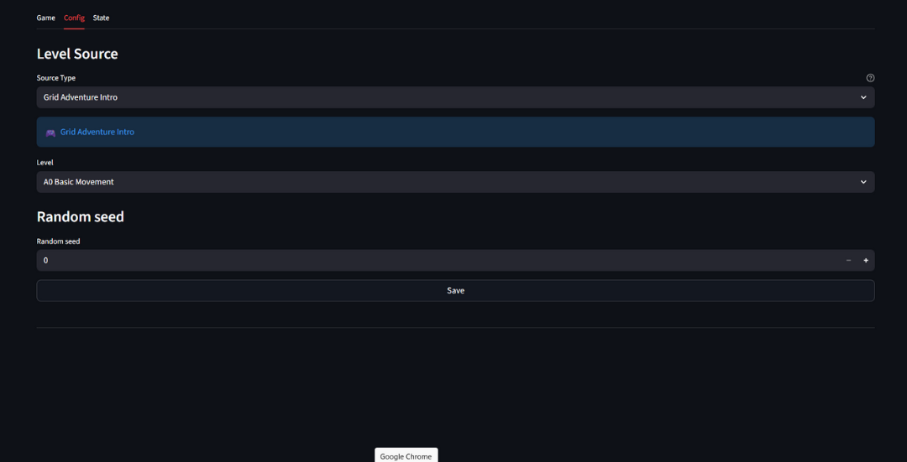

# Config Tab

The Config tab lets you select and configure game levels before playing.

## Level Sources

Grid Play provides two types of level sources:

### Intro Levels

Pre-designed levels for learning game mechanics.



| Source | Description |
|--------|-------------|
| **Gameplay Example** | 14 tutorial levels with progressive difficulty |

These levels introduce core concepts step-by-step: movement, items, doors, and hazards. Select a level from the dropdown and click **Save** to play.

### Custom Levels

Configurable levels for experimentation and testing.

| Source | Description |
|--------|-------------|
| **Procedural Maze** | Randomly generated mazes with adjustable parameters |
| **Cipher Example** | Micro-levels with cipher-based objectives |
| **Level Editor** | Visual editor to create your own levels |

Custom levels offer full control over grid size, items, enemies, hazards, powerups, and gameplay rules. Adjust the parameters to create the experience you want.

## Common Settings

| Setting | Description |
|---------|-------------|
| **Random Seed** | Controls randomization for reproducible levels |
| **Image Map** | Visual asset pack for rendering |
| **Save** | Apply configuration and start playing |

## Running from Terminal

### Basic Usage

Run with built-in sources (Intro + Custom levels):

```bash
grid-play
```

### Loading Plugins

Load additional level sources from an installed module:

```bash
grid-play --plugin <module_name>
```

Load from a Python file:

```bash
grid-play --plugin-file path/to/plugin.py
```

Load multiple plugins:

```bash
grid-play --plugin module1 --plugin module2 --plugin-file custom.py
```

### CLI Options

| Option | Description |
|--------|-------------|
| `-p`, `--plugin` | Plugin module to import (repeatable) |
| `-f`, `--plugin-file` | Plugin Python file to import (repeatable) |
| `--built-in-sources` | Include built-in sources when using plugins |
