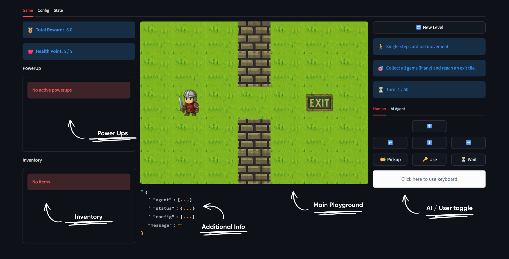
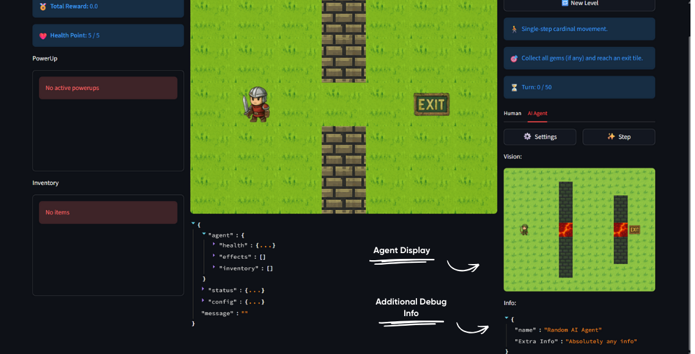

# Game Tab

The Game tab is where you play and interact with Grid Universe levels. It provides real-time visual feedback, player status, and multiple control options.  

## Interface Layout

The Game tab provide information on the current representation of an ongoing game in the game.

| Components | Description |
| -- | -- |
| Left Column | Overall Information of the game |
| Middle Column | Game View using `Observation` Class |
| Right Column | Agent Control Panel |

### Left Column - Player Status

Displays your current game status:

| Indicator | Description |
|-----------|-------------|
| **Total Reward** | Your accumulated score/reward points |
| **Health Points** | Current HP with damage notifications |
| **PowerUp Status** | Active temporary effects |
| **Inventory** | Items you've collected |
| **PowerUp** | Active Powerups |
| **Inventory** | Collected Items in Inventory |

### Middle Column - Game View

The central area shows:

- **Game Visualization** - Real-time rendering of the grid world
- **Observation Info** - JSON display of the current game state data

### Right Column - Game Info

Provides context about your current level:

| Section | Description |
|---------|-------------|
| **New Level** | Button to generate a new level variant |
| **Level Rules** | Movement type (e.g., cardinal directions) |
| **Objective** | What you need to do to win |
| **Turn Counter** | Remaining turns (if turn limit exists) |
| **Agent Control** | Switch between Button, Keyboard & Code control |

### AI Agent Mode

The AI Agent tab allows you to test automated agents:

### Loading an Agent

1. Click the **Settings** button to open the agent dialog
2. Paste your agent code or use the provided template
3. Click **Load** to compile and initialize the agent

### Running the Agent

- Click **Step** to execute one action from your AI agent
- The **Vision** display shows what the agent "sees" using the `parse` function
- The **Info** display shows debug information from your agent using the `info` function.

